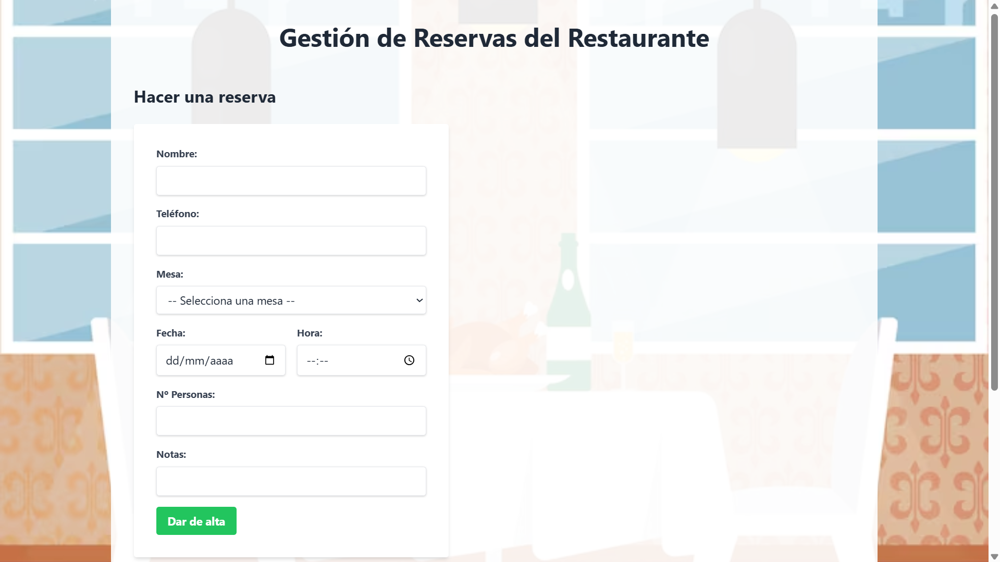
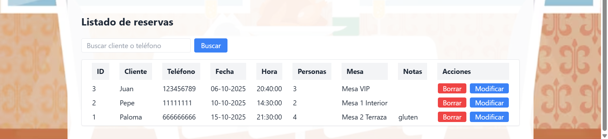
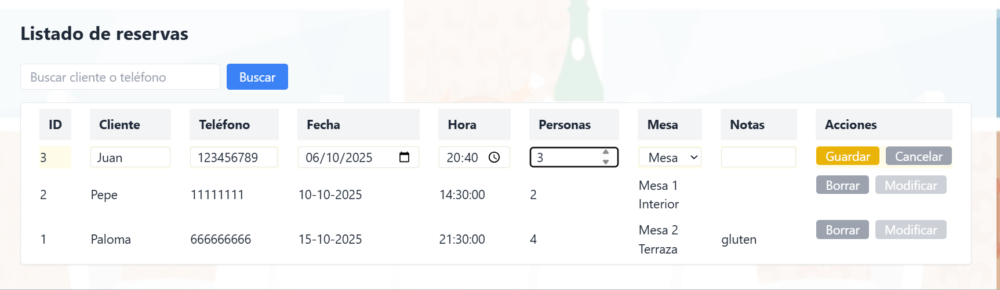
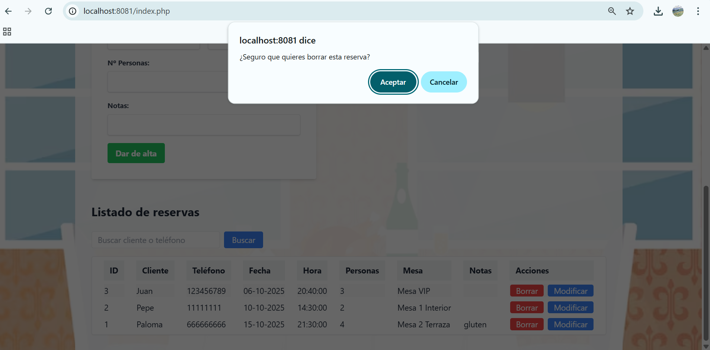
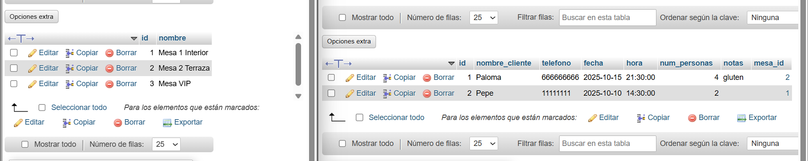

# 🍽️ Gestión de Restaurante

Sistema de gestión de reservas de restaurante desarrollado con PHP y MySQL.

## 📋 Descripción

Aplicación web para la gestión de reservas de un restaurante, incluyendo:
- Sistema de reservas de mesas
- Gestión de clientes
- Interfaz web con PHP
- Base de datos MySQL

## 🛠️ Tecnologías Utilizadas

- **PHP** - Lenguaje de programación del servidor
- **MySQL** - Base de datos relacional
- **HTML/CSS** - Interfaz de usuario
- **Docker** - Containerización

## 📸 Imágenes

### Interfaz Principal
*Pantalla principal del sistema de gestión de reservas*

*Formulario para crear nuevas reservas de mesa*

*Vista del listado de todas las reservas activas*

### Edición de Reservas

*Formulario para modificar reservas existentes*

### Eliminación de Reservas

*Confirmación de eliminación de reservas*

### Base de Datos (phpMyAdmin)

*Vista de la base de datos MySQL en phpMyAdmin*

